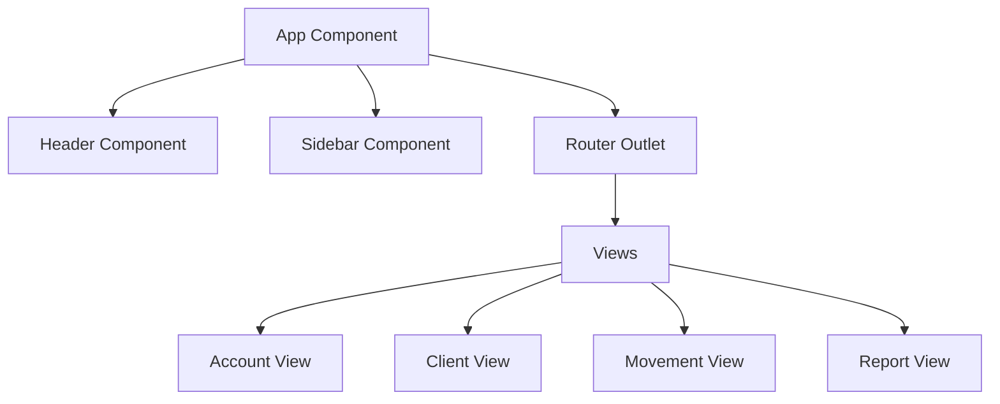
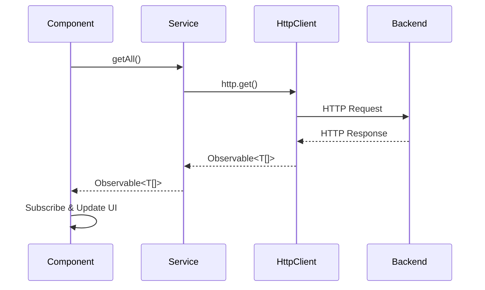

# 🏗️ Documentación de Arquitectura Técnica

## 📐 Visión General de la Arquitectura

### Principios de Diseño

1. **Separación de Responsabilidades**: Cada componente tiene una responsabilidad específica
2. **Reutilización**: Componentes base que pueden ser extendidos
3. **Mantenibilidad**: Código limpio y documentado
4. **Escalabilidad**: Estructura modular que facilita el crecimiento
5. **Performance**: Optimizaciones con OnPush y lazy loading

## 🧩 Componentes de la Arquitectura

### Capa de Presentación (Components)



#### Componentes Base (Abstract)

```typescript
// BaseComponent - Funcionalidad común
export abstract class BaseComponent implements OnDestroy {
  protected readonly cdr = inject(ChangeDetectorRef);
  protected readonly destroy$ = new Subject<void>();

  // Estados comunes
  isLoading = false;
  hasError = false;
  isEmpty = false;
}

// BaseFormComponent - Formularios
export abstract class BaseFormComponent extends BaseComponent {
  protected readonly fb = inject(FormBuilder);
  protected readonly router = inject(Router);
  protected readonly alert = inject(AlertService);

  protected abstract form: FormGroup;
}
```

#### Jerarquía de Herencia

```
BaseComponent
├── BaseFormComponent
│   ├── AccountFormComponent
│   ├── ClientFormComponent
│   ├── MovementFormComponent
│   └── ReportFormComponent
├── AccountListComponent
├── ClientListComponent
├── MovementListComponent
└── ReportListComponent
```

### Capa de Servicios (Business Logic)

```typescript
interface ServicePattern {
  // CRUD Operations
  getAll(): Observable<T[]>;
  getById(id: number): Observable<T>;
  create(item: Omit<T, 'id'>): Observable<T>;
  update(id: number, item: Partial<T>): Observable<T>;
  delete(id: number): Observable<void>;

  // Error Handling
  private handleError(error: HttpErrorResponse);
}
```

#### Servicios Implementados

1. **AccountService**: Gestión de cuentas bancarias
2. **ClientService**: Gestión de clientes
3. **MovementService**: Gestión de movimientos
4. **ReportService**: Generación de reportes
5. **AlertService**: Notificaciones y alertas
6. **MenuService**: Configuración del menú

### Capa de Datos (Types & Interfaces)

```typescript
// Tipos de dominio
export type Account = {
  accountId: number;
  number: string;
  type: string;
  balance: number;
  status: boolean;
  clientId: number;
};

export type Client = {
  id: number;
  identification: string;
  name: string;
  gender: string;
  age: number;
  address: string;
  phone: string;
  password: string;
  status: boolean;
};
```

## 🔄 Flujo de Datos

### Patrón Observer (RxJS)



### Gestión de Estado

```typescript
// Patrón de manejo de estado en componentes
export class AccountsViewComponent extends BaseComponent {
  protected accounts: Account[] = [];
  protected filteredAccounts: Account[] = [];

  ngOnInit(): void {
    this.loadAccounts();
  }

  private loadAccounts(): void {
    this.setLoading(true);

    this.accountService
      .getAll()
      .pipe(
        takeUntil(this.destroy$),
        finalize(() => this.setLoading(false)),
      )
      .subscribe({
        next: (accounts) => {
          this.accounts = accounts;
          this.filteredAccounts = accounts;
        },
        error: (error) => this.handleError(error),
      });
  }
}
```

## 🎯 Patrones de Diseño Implementados

### 1. Template Method Pattern

```typescript
// BaseFormComponent define el template
export abstract class BaseFormComponent {
  // Template method
  onSubmit(): void {
    if (this.form.invalid) {
      this.markTouched();
      return;
    }

    this.processForm(); // Abstract method
  }

  protected abstract processForm(): void;
}

// Implementación específica
export class ClientFormComponent extends BaseFormComponent {
  protected processForm(): void {
    const client = this.form.getRawValue();
    const request = this.isEditing ? this.clientService.update(this.clientId, client) : this.clientService.create(client);

    // ... resto de la lógica
  }
}
```

### 2. Observer Pattern (RxJS)

```typescript
// Búsqueda con debounce
setupSearch(): void {
  this.searchControl.valueChanges
    .pipe(
      debounceTime(300),
      distinctUntilChanged(),
      map(term => this.filterAccounts(term || '')),
      takeUntil(this.destroy$)
    )
    .subscribe(filtered => this.filteredAccountsChange.emit(filtered));
}
```

### 3. Factory Pattern

```typescript
// FormBuilder como factory
private createForm(): FormGroup {
  return this.fb.group({
    identification: ['', Validators.required],
    name: ['', Validators.required],
    gender: ['', Validators.required],
    age: [null, [Validators.required, Validators.min(18)]],
    // ... más campos
  });
}
```

### 4. Strategy Pattern

```typescript
// Diferentes estrategias de validación
protected getFieldError(fieldName: string): string {
  const control = this.form.get(fieldName);
  if (!control?.touched || !control?.errors) return '';

  const errors = control.errors;

  // Estrategias de error
  if (errors['required']) return 'Este campo es requerido';
  if (errors['min']) return 'Valor muy pequeño';
  if (errors['email']) return 'Email inválido';
  if (errors['minlength']) return 'Demasiado corto';

  return 'Campo inválido';
}
```

## 🔧 Configuración y Environment

### Gestión de Configuración

```typescript
// Environment Interface
export interface Environment {
  production: boolean;
  apiUrl: string;
}

// Development
export const environment: Environment = {
  production: false,
  apiUrl: "https://dev-api.com",
};

// Production
export const environment: Environment = {
  production: true,
  apiUrl: "https://prod-api.com",
};
```

### Dependency Injection

```typescript
// Patrón moderno de DI con inject()
export class ClientFormComponent {
  private readonly route = inject(ActivatedRoute);
  private readonly clientService = inject(ClientService);
  private readonly alertService = inject(AlertService);

  // En lugar de constructor injection
  // constructor(
  //   private route: ActivatedRoute,
  //   private clientService: ClientService
  // ) {}
}
```

## 🚀 Optimizaciones de Performance

### Change Detection Strategy

```typescript
@Component({
  selector: "app-client-list",
  changeDetection: ChangeDetectionStrategy.OnPush,
  // ...
})
export class ClientListComponent {
  // Solo se ejecuta change detection cuando:
  // 1. @Input() cambia (referencia)
  // 2. Evento del template
  // 3. Manualmente con cdr.markForCheck()
}
```

### TrackBy Functions

```typescript
export class AccountListComponent {
  protected readonly trackById = (_: number, account: Account): number => account.accountId;
}
```

```html
<div *ngFor="let account of accounts; trackBy: trackById">
  <!-- Angular solo re-renderiza si el ID cambia -->
</div>
```

### Memory Leak Prevention

```typescript
export class BaseComponent implements OnDestroy {
  protected readonly destroy$ = new Subject<void>();

  ngOnDestroy(): void {
    this.destroy$.next();
    this.destroy$.complete();
  }
}

// Uso en componentes
this.service
  .getData()
  .pipe(takeUntil(this.destroy$))
  .subscribe((data) => {
    // Se desuscribe automáticamente al destruir el componente
  });
```

## 📊 Análisis de Complejidad

### Métricas de Calidad

```typescript
// Complejidad Ciclomática: Baja (1-10)
// Acoplamiento: Bajo (dependency injection)
// Cohesión: Alta (single responsibility)
// Mantenibilidad: Alta (patrones consistentes)
```

### Cobertura de Funcionalidades

- ✅ CRUD Completo para todas las entidades
- ✅ Validaciones robustas
- ✅ Manejo de errores centralizado
- ✅ Estados de carga y vacío
- ✅ Búsqueda y filtrado
- ✅ Navegación SPA

## 🔮 Escalabilidad Futura

### Preparado para:

1. **Micro-frontends**: Arquitectura modular lista para separar
2. **State Management**: Fácil integración con NgRx/Akita
3. **Testing**: Estructura testeable con DI y separation of concerns
4. **Internationalization**: Preparado para i18n
5. **PWA**: Service workers y offline capabilities
6. **Module Federation**: Webpack 5 ready

### Puntos de Extensión:

```typescript
// Nuevos módulos de negocio
interface BusinessModule {
  components: ComponentRegistry;
  services: ServiceRegistry;
  routes: Route[];
}

// Nuevas estrategias de validación
interface ValidationStrategy {
  validate(control: AbstractControl): ValidationErrors | null;
}

// Nuevos tipos de reportes
interface ReportGenerator {
  generate(filter: ReportFilter): Observable<Report[]>;
}
```

---

**Esta arquitectura garantiza un código mantenible, escalable y de alta calidad para el sistema bancario BP Challenge.**
