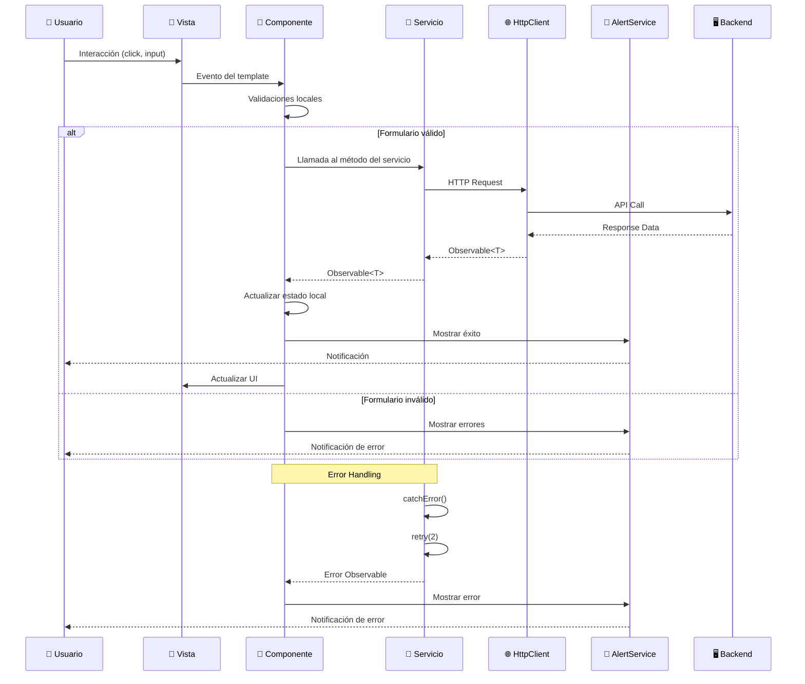
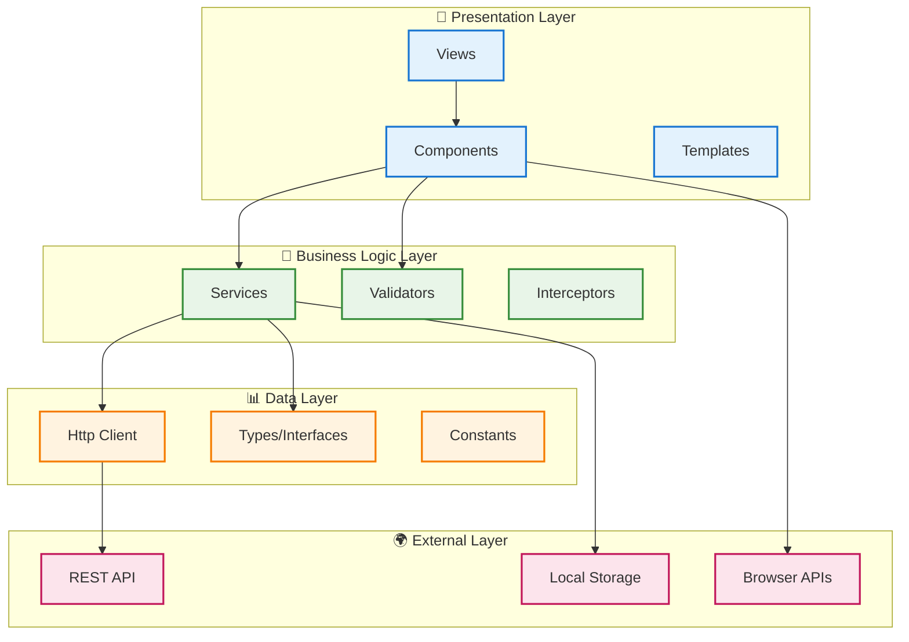
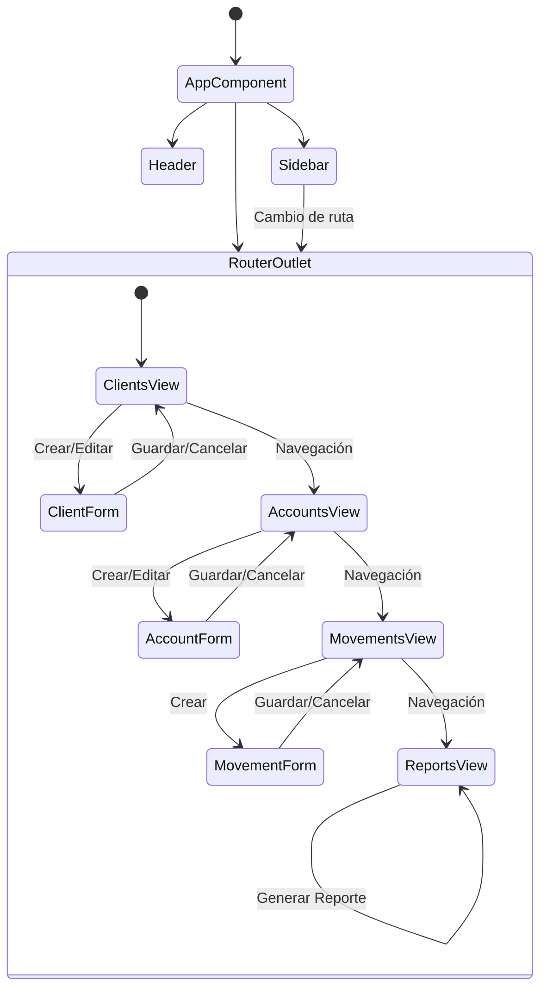
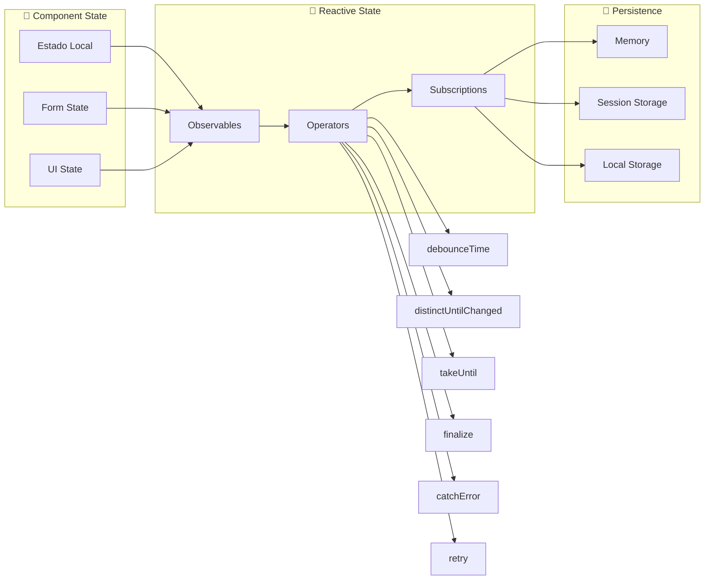
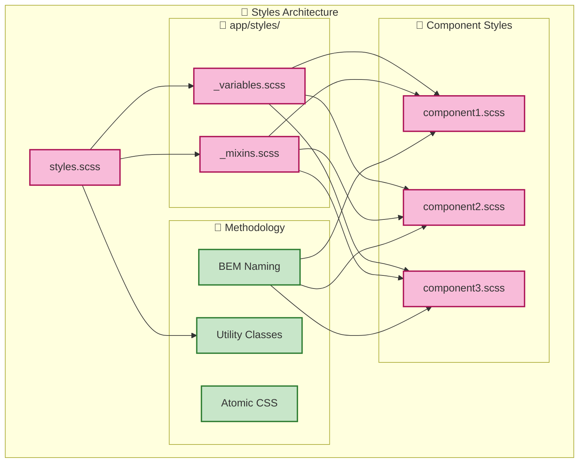
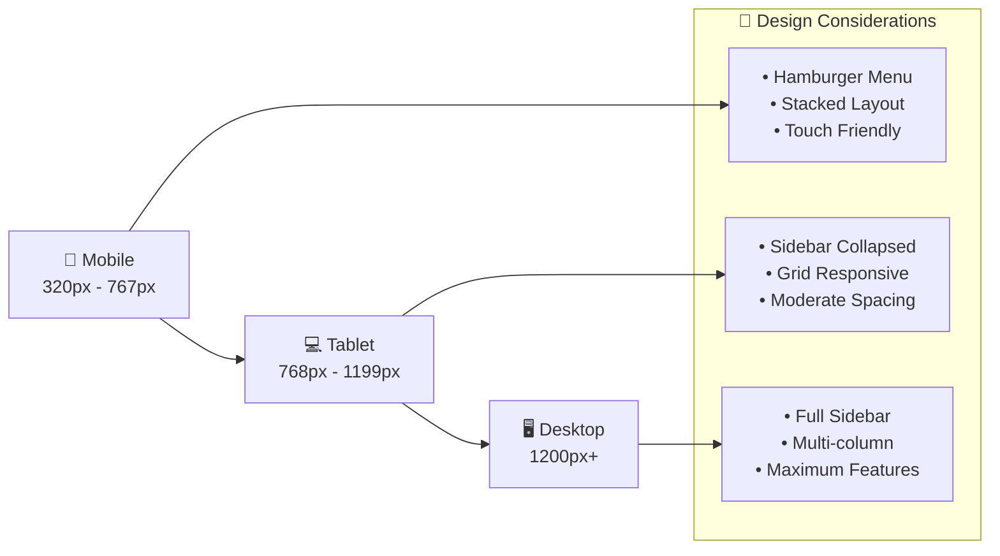
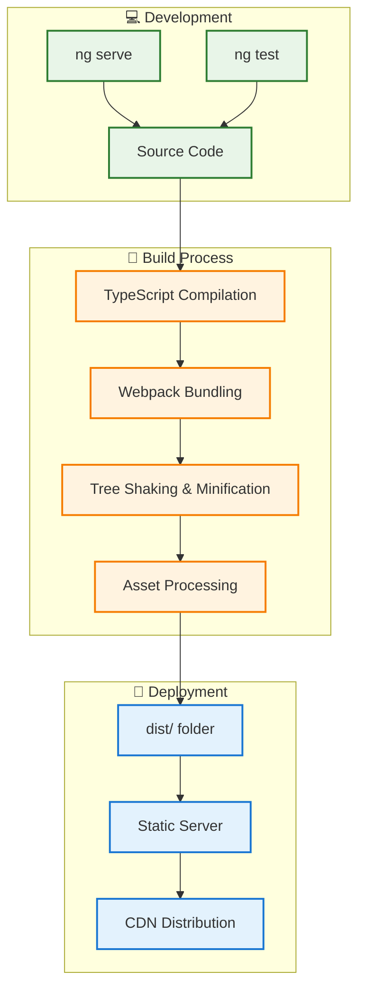

# 📊 Diagramas de Arquitectura - BP Challenge

## 🏗️ Diagrama de Componentes

```mermaid
graph TB
    subgraph "🌐 Angular Application"
        subgraph "📱 Core Components"
            APP[App Component]
            HEADER[Header Component]
            SIDEBAR[Sidebar Component]
            ROUTER[Router Outlet]
        end

        subgraph "👀 Views Layer"
            ACCOUNTS_VIEW[Accounts View]
            CLIENTS_VIEW[Clients View]
            MOVEMENTS_VIEW[Movements View]
            REPORTS_VIEW[Reports View]
        end

        subgraph "🧩 Feature Components"
            subgraph "💳 Account Components"
                ACC_FORM[Account Form]
                ACC_LIST[Account List]
                ACC_SEARCH[Account Search]
            end

            subgraph "👥 Client Components"
                CLI_FORM[Client Form]
                CLI_LIST[Client List]
                CLI_SEARCH[Client Search]
            end

            subgraph "💰 Movement Components"
                MOV_FORM[Movement Form]
                MOV_LIST[Movement List]
                MOV_SEARCH[Movement Search]
            end

            subgraph "📊 Report Components"
                REP_FORM[Report Form]
                REP_LIST[Report List]
                REP_SEARCH[Report Search]
            end
        end

        subgraph "🔧 Services Layer"
            ACC_SERVICE[Account Service]
            CLI_SERVICE[Client Service]
            MOV_SERVICE[Movement Service]
            REP_SERVICE[Report Service]
            ALERT_SERVICE[Alert Service]
            MENU_SERVICE[Menu Service]
        end

        subgraph "📦 Base Classes"
            BASE_COMP[Base Component]
            BASE_FORM[Base Form Component]
        end
    end

    subgraph "🌍 External APIs"
        BACKEND[Backend API]
        MOCK_API[Mock API]
    end

    %% Connections
    APP --> HEADER
    APP --> SIDEBAR
    APP --> ROUTER

    ROUTER --> ACCOUNTS_VIEW
    ROUTER --> CLIENTS_VIEW
    ROUTER --> MOVEMENTS_VIEW
    ROUTER --> REPORTS_VIEW

    ACCOUNTS_VIEW --> ACC_FORM
    ACCOUNTS_VIEW --> ACC_LIST
    ACCOUNTS_VIEW --> ACC_SEARCH

    CLIENTS_VIEW --> CLI_FORM
    CLIENTS_VIEW --> CLI_LIST
    CLIENTS_VIEW --> CLI_SEARCH

    MOVEMENTS_VIEW --> MOV_FORM
    MOVEMENTS_VIEW --> MOV_LIST
    MOVEMENTS_VIEW --> MOV_SEARCH

    REPORTS_VIEW --> REP_FORM
    REPORTS_VIEW --> REP_LIST
    REPORTS_VIEW --> REP_SEARCH

    %% Service connections
    ACC_FORM --> ACC_SERVICE
    ACC_LIST --> ACC_SERVICE
    CLI_FORM --> CLI_SERVICE
    CLI_LIST --> CLI_SERVICE
    MOV_FORM --> MOV_SERVICE
    MOV_LIST --> MOV_SERVICE
    REP_FORM --> REP_SERVICE
    REP_LIST --> REP_SERVICE

    %% Base class inheritance
    BASE_COMP -.-> ACCOUNTS_VIEW
    BASE_COMP -.-> CLIENTS_VIEW
    BASE_COMP -.-> MOVEMENTS_VIEW
    BASE_COMP -.-> REPORTS_VIEW

    BASE_FORM -.-> ACC_FORM
    BASE_FORM -.-> CLI_FORM
    BASE_FORM -.-> MOV_FORM
    BASE_FORM -.-> REP_FORM

    %% External connections
    ACC_SERVICE --> BACKEND
    CLI_SERVICE --> BACKEND
    MOV_SERVICE --> BACKEND
    REP_SERVICE --> MOCK_API

    SIDEBAR --> MENU_SERVICE

    %% Styling
    classDef viewClass fill:#e1f5fe,stroke:#01579b,stroke-width:2px
    classDef componentClass fill:#f3e5f5,stroke:#4a148c,stroke-width:2px
    classDef serviceClass fill:#e8f5e8,stroke:#1b5e20,stroke-width:2px
    classDef baseClass fill:#fff3e0,stroke:#e65100,stroke-width:2px
    classDef externalClass fill:#ffebee,stroke:#b71c1c,stroke-width:2px

    class ACCOUNTS_VIEW,CLIENTS_VIEW,MOVEMENTS_VIEW,REPORTS_VIEW viewClass
    class ACC_FORM,ACC_LIST,ACC_SEARCH,CLI_FORM,CLI_LIST,CLI_SEARCH,MOV_FORM,MOV_LIST,MOV_SEARCH,REP_FORM,REP_LIST,REP_SEARCH componentClass
    class ACC_SERVICE,CLI_SERVICE,MOV_SERVICE,REP_SERVICE,ALERT_SERVICE,MENU_SERVICE serviceClass
    class BASE_COMP,BASE_FORM baseClass
    class BACKEND,MOCK_API externalClass
```

## 🔄 Flujo de Datos

## 🏛️ Arquitectura por Capas

## 🎯 Patrón de Navegación

## 🔧 Gestión de Estado

## 🎨 Estructura de Estilos

## 📱 Responsive Breakpoints

## 🚀 Build & Deploy Pipeline

---

## 📝 Notas sobre los Diagramas

### Herramientas Recomendadas para Visualización:

1. **Mermaid**: Los diagramas están en formato Mermaid y se pueden visualizar en:
   - GitHub (automáticamente)
   - VS Code con extensión Mermaid
   - [Mermaid Live Editor](https://mermaid.live/)

2. **Draw.io**: Para diagramas más complejos
3. **PlantUML**: Para diagramas UML detallados
4. **Lucidchart**: Para diagramas profesionales

### Leyenda de Colores:

- 🔵 **Azul**: Componentes de presentación
- 🟢 **Verde**: Lógica de negocio/servicios
- 🟠 **Naranja**: Capa de datos
- 🔴 **Rojo**: APIs externas
- 🟣 **Púrpura**: Componentes reutilizables

Estos diagramas proporcionan una visión clara de la arquitectura y pueden ser utilizados en presentaciones técnicas o documentación para otros desarrolladores.
